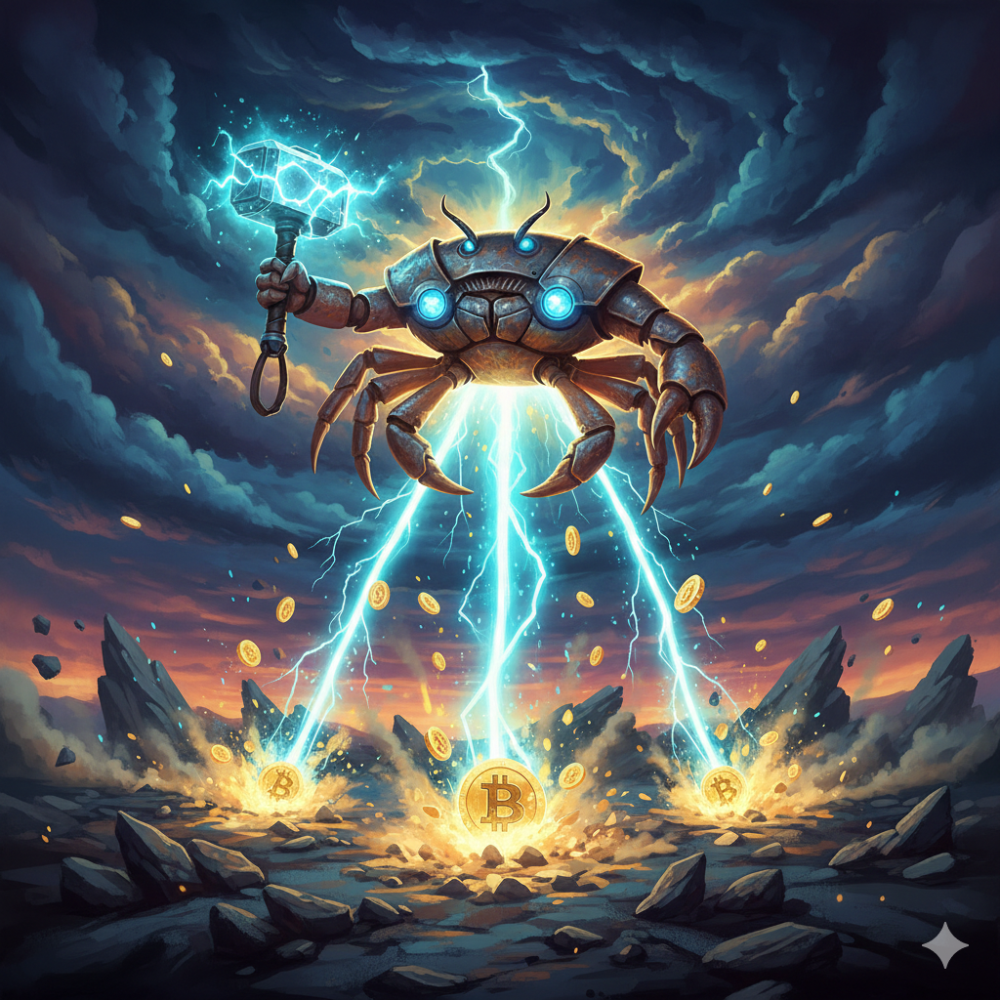
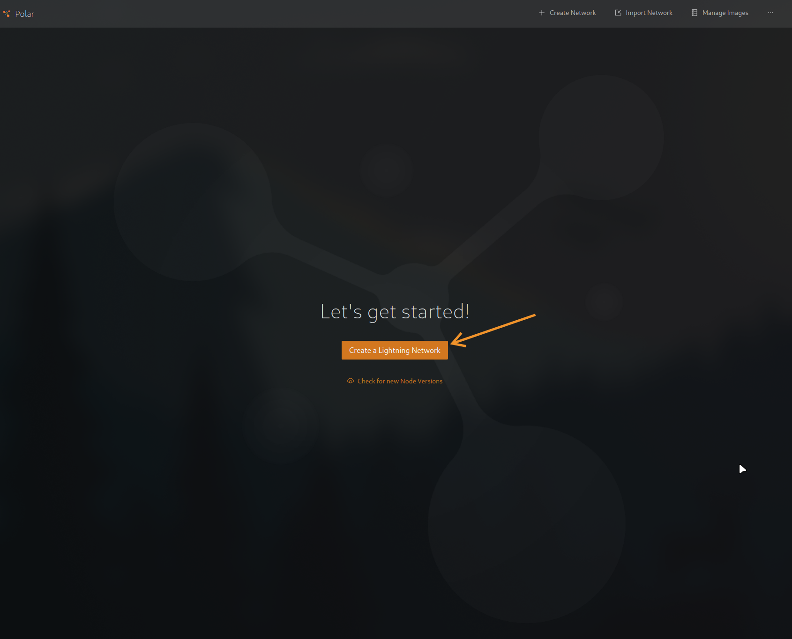
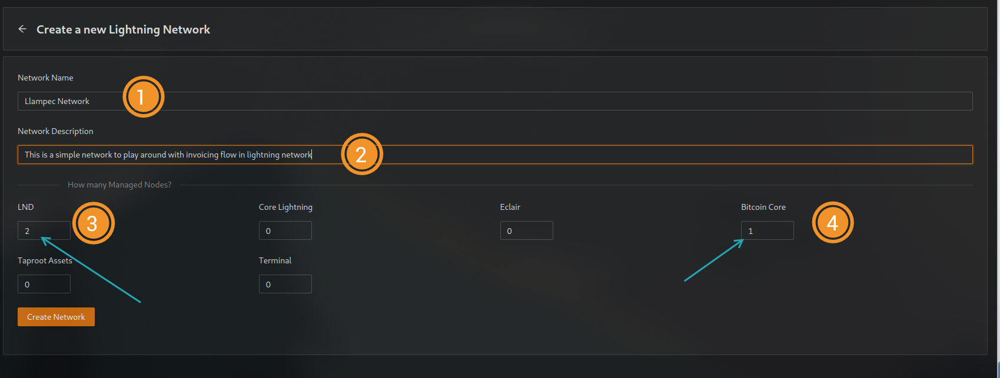
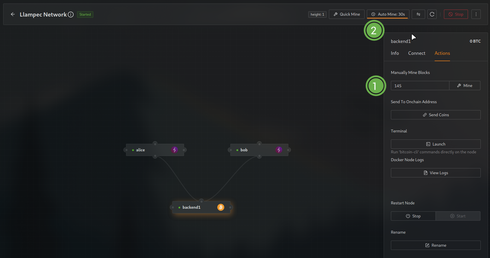
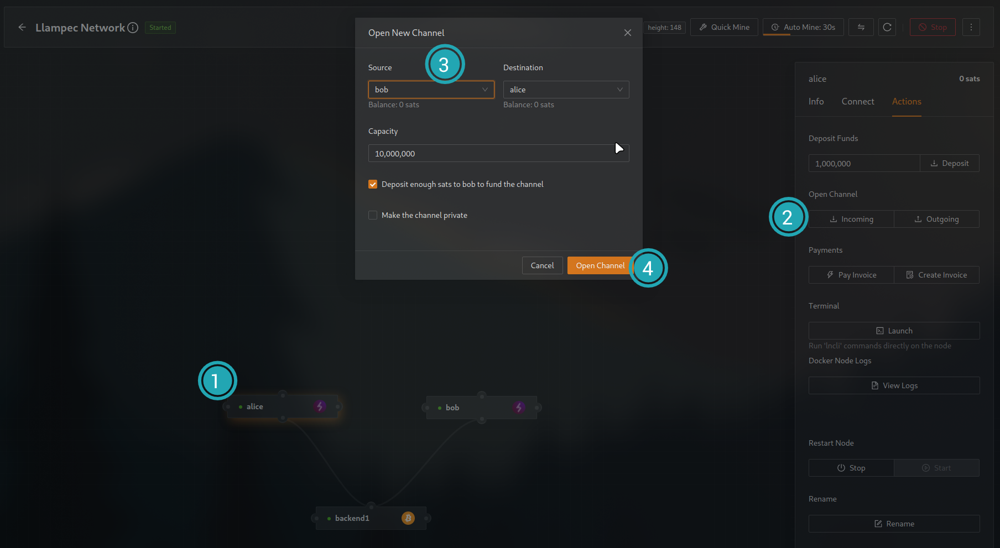
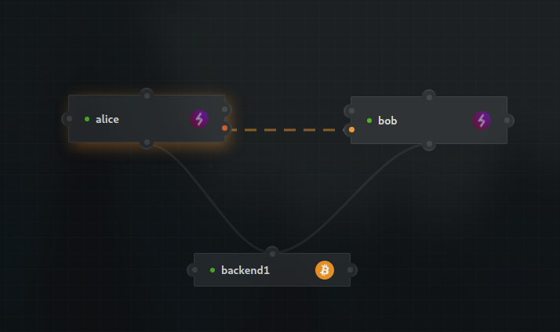
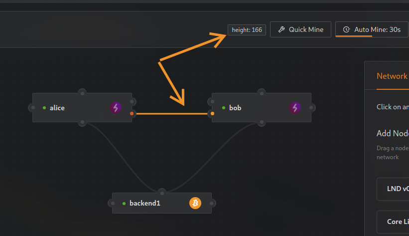
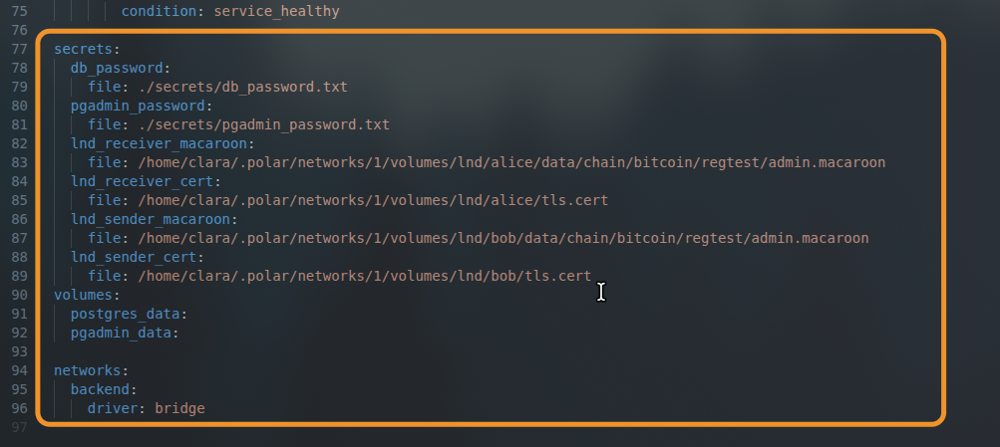
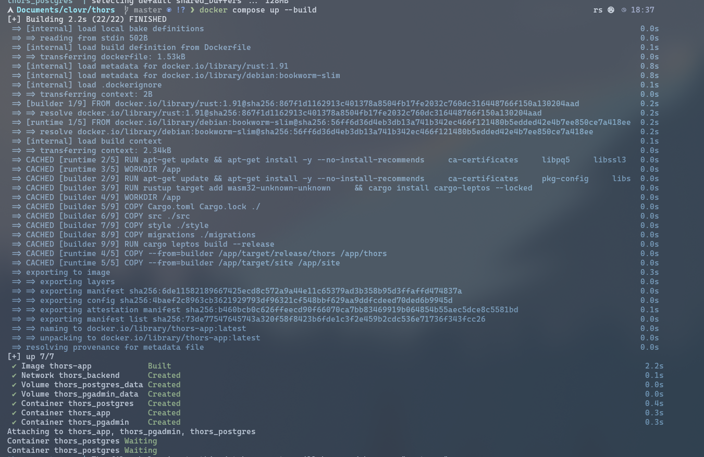
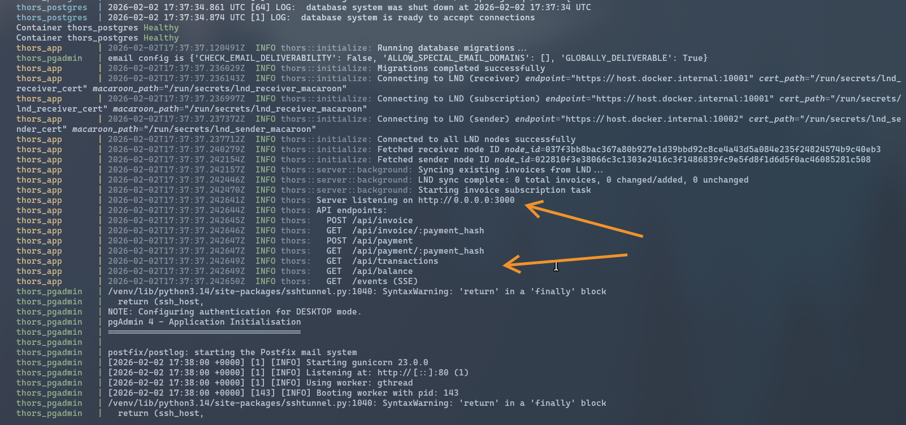

<p align="center">
  
</p>

<h1 align="center">THOrs - Lightning Network Payments</h1>

<p align="center">
  A full-stack Rust application for sending and receiving Lightning Network payments via LND nodes.
</p>

<p align="center">
  Built with <a href="https://leptos.dev/">Leptos</a> | Powered by <a href="https://lightning.network/">Lightning Network</a>
</p>

---

## Table of Contents

- [Overview](#overview)
- [Architecture](#architecture)
- [Dependencies](#dependencies)
- [Setup Guide](#setup-guide)
- [Build and Run](#build-and-run)
- [Environment Configuration](#environment-configuration)
- [API Reference](#api-reference)
- [Real-Time Events (SSE)](#real-time-events-sse)
- [Integration Tests](#integration-tests)
- [Possible Errors and Troubleshooting](#possible-errors-and-troubleshooting)
- [Good Practices and Future Improvements](#good-practices-and-future-improvements)
- [License](#license)
- [Author](#author)

---

## Overview

THOrs is a Lightning Network payment application that connects to two LND nodes to handle payments:

- **Alice** acts as the **Receiver** — she creates invoices and receives payments.
- **Bob** acts as the **Sender** — he pays invoices and sends sats.

The application provides a modern web UI for creating Lightning invoices with QR codes, paying invoices, and tracking transaction history in real-time through Server-Sent Events (SSE).

This project was built with [Leptos](https://leptos.dev/), a full-stack Rust framework that compiles the frontend to WebAssembly and renders the backend with SSR (Server-Side Rendering) on [Axum](https://github.com/tokio-rs/axum). Leptos was chosen because it offers a **single-service full-stack solution** — frontend components can call server functions directly without the overhead of defining separate API clients. This makes development faster and type-safe across the entire stack. That said, the architecture can be split into separate frontend and backend services if needed in the future.

> **Note:** The Lightning Network offers a vast ecosystem of features and concepts beyond what is implemented here. The API is intentionally kept as simple as requested, focusing on the core send/receive flow. There is much more to explore in the Lightning protocol.

---

## Architecture

### High-Level Overview

```
┌──────────────────────────────────────────────────────┐
│                   Browser (WASM)                     │
│  ReceivePanel | SendPanel | TransactionList | QR     │
│              ↕ Server Functions + SSE                │
├──────────────────────────────────────────────────────┤
│                 Axum Server (SSR)                     │
│  REST API | Server Functions | SSE Broadcast         │
│              ↕                    ↕                   │
│     PostgreSQL (Diesel)    Background Tasks           │
│              ↕                    ↕                   │
├──────────────────────────────────────────────────────┤
│              Lightning Network (gRPC)                │
│      Alice (Receive)         Bob (Send)              │
└──────────────────────────────────────────────────────┘
```

### LND Connections

The application establishes **three separate gRPC connections** to the Lightning nodes:

| Connection | Node | Purpose |
|---|---|---|
| **Receive API** | Alice | Create invoices, query invoice status |
| **Subscription** | Alice | Long-lived stream listening for invoice state changes (settled, expired) |
| **Send API** | Bob | Send payments, decode payment requests |

The subscription connection is consumed by a background task that runs for the entire lifetime of the application. The other two are wrapped in a secure way for shared concurrent access across HTTP handlers.

### Data Flow

1. **Creating an Invoice:** User enters amount in the UI -> Leptos server function -> LND Alice creates the invoice -> background task picks up the event -> upserts into PostgreSQL -> broadcasts via SSE -> all connected clients update in real-time.

2. **Paying an Invoice:** User pastes a BOLT#11 invoice (decoded client-side in WASM, no server round-trip needed) -> submits payment -> Leptos server function -> LND Bob sends the payment -> result is saved to PostgreSQL -> SSE broadcast -> UI updates.

3. **Real-Time Updates:** A background task subscribes to Alice's invoice stream. When an invoice is settled or expires, it upserts the transaction into the database and broadcasts the event through a tokio broadcast channel to all connected SSE clients.

### Technology Stack

| Layer | Technology |
|---|---|
| Frontend | Leptos 0.8 (SSR + Hydrate to WASM) |
| Backend | Axum 0.8 + Leptos Server Functions |
| Database | PostgreSQL 16 + Diesel ORM (async) |
| Lightning | tonic-lnd 0.5.1 (gRPC) |
| Runtime | Tokio |
| Containerization | Docker + Docker Compose |

---

## Dependencies

To run this project you need the following installed on your system:

| Dependency | Purpose |
|---|---|
| **[Docker](https://docs.docker.com/get-docker/)** with **[Docker Compose](https://docs.docker.com/compose/)** | Containerized build and deployment of the app, PostgreSQL, and PgAdmin |
| **[Polar](https://lightningpolar.com/)** | Local Lightning Network simulator for creating and managing LND nodes |

> **Highly recommended:** Use **Linux** for running this project. It has been developed and tested on Linux. While it may work on other operating systems, Linux is the recommended environment for the smoothest experience.

No IDE or AI tools are required. Everything runs through Docker and Polar.

### Additional Tools (Optional)

| Tool | Purpose |
|---|---|
| `curl` + `jq` | Required only if you want to run the integration test script (`test_api.sh`) |

---

## Setup Guide

Follow these steps to get the full Lightning Network environment running locally:

### Step 1 — Start Polar

Open Polar and click **"Create a Lightning Network"** to get started.



### Step 2 — Create a Network

Create a new network with the following configuration:

1. Give your network a name and description
2. Set **LND** nodes to **2** (these will be Alice and Bob)
3. Keep **Bitcoin Core** at **1**
4. Leave everything else at 0

Click **"Create Network"** and start it.



### Step 3 — Mine Blocks and Configure Auto-Mining

Once the network is running:

1. Mine several blocks manually to generate initial funds
2. Set **Auto Mine** interval to **30 seconds** so blocks are mined automatically

This ensures transactions are confirmed without manual intervention.



### Step 4 — Open a Channel Between Alice and Bob

Create a payment channel:

1. Select **Alice** as the source node
2. Select **Bob** as the destination
3. Set a capacity for the channel
4. Click **"Open Channel"**

Alice will receive payments, Bob will send them.



### Step 5 — Wait for Channel Confirmation

You will see a **dotted line** between Alice and Bob indicating the channel is being established. Mine a few blocks to confirm the channel. Once confirmed, the line becomes solid.



### Step 6 — Copy GRPC Endpoints

Once the channel is up, click on each node (Alice and Bob) to find their **GRPC** host and port. You will need these values for the `docker-compose.yml` configuration.

Take note of:
- Alice's GRPC endpoint (e.g., `127.0.0.1:10001`)
- Bob's GRPC endpoint (e.g., `127.0.0.1:10002`)



### Step 7 — Configure Secrets in docker-compose.yml

Modify the `secrets` section at the bottom of `docker-compose.yml` to point to your Polar node files:

```yaml
secrets:
  db_password:
    file: ./secrets/db_password.txt
  pgadmin_password:
    file: ./secrets/pgadmin_password.txt
  lnd_receiver_macaroon:
    file: /home/<user>/.polar/networks/<N>/volumes/lnd/alice/data/chain/bitcoin/regtest/admin.macaroon
  lnd_receiver_cert:
    file: /home/<user>/.polar/networks/<N>/volumes/lnd/alice/tls.cert
  lnd_sender_macaroon:
    file: /home/<user>/.polar/networks/<N>/volumes/lnd/bob/data/chain/bitcoin/regtest/admin.macaroon
  lnd_sender_cert:
    file: /home/<user>/.polar/networks/<N>/volumes/lnd/bob/tls.cert
```

Replace `<user>` with your system username and `<N>` with your Polar network number.

> **Important:** The `secrets/` directory included in this repository contains placeholder files for **testing and demonstration purposes only**. In a production environment, secrets must be managed through a proper secrets management system (e.g., Docker Swarm secrets, Vault, or environment-specific secure storage).



### Step 8 — Build and Run

Now you can build and start the entire stack with a single command:

```bash
docker compose up --build
```

This will:
- Build the Rust application (server + WASM client) in a multi-stage Docker build
- Start PostgreSQL 16
- Start PgAdmin (accessible at `http://localhost:5050`)
- Start the THOrs application



Wait for the build to complete and the server to start. You will see logs indicating successful LND connections and the server listening message.



### Step 9 — Access the Application

Open your browser and navigate to:

```
http://localhost:3000
```

You're ready to create invoices with Alice and pay them with Bob!

---

## Build and Run

The primary build and run command is:

```bash
docker compose up --build
```

This handles everything: compiling Rust, building the WASM frontend, running database migrations, and starting all services.

### Services Started

| Service | Port | Description |
|---|---|---|
| **thors_app** | `3000` | Main application (UI + API) |
| **thors_postgres** | `5432` | PostgreSQL 16 database |
| **thors_pgadmin** | `5050` | PgAdmin 4 web interface |

### Stopping the Services

```bash
docker compose down
```

To also remove persistent volumes (database data):

```bash
docker compose down -v
```

---

## Environment Configuration

For testing and presentation purposes, you can simply copy the example environment file:

```bash
cp .env.example .env
```

Then update the `LND_ENDPOINT` and `LND_SEND_ENDPOINT` values to match your Polar node GRPC addresses. The endpoints use `host.docker.internal` to reach the host machine from within the Docker container.

### Key Environment Variables

| Variable | Description |
|---|---|
| `LND_ENDPOINT` | Alice's (receiver) GRPC endpoint |
| `LND_SEND_ENDPOINT` | Bob's (sender) GRPC endpoint |
| `LND_CERT_PATH` / `LND_MACAROON_PATH` | Alice's TLS certificate and macaroon paths |
| `LND_SEND_CERT_PATH` / `LND_SEND_MACAROON_PATH` | Bob's TLS certificate and macaroon paths |
| `DATABASE_URL` | PostgreSQL connection string |
| `DB_PASSWORD` | Database password |
| `RUN_MIGRATIONS` | Set to `true` to auto-run Diesel migrations on startup |
| `RUST_LOG` | Log level (e.g., `info`, `debug`, `trace`) |

---

## API Reference

All API endpoints return JSON responses. Error responses follow the format `{"error": "description"}`.

### `POST /api/invoice` — Create an Invoice

Creates a Lightning invoice on Alice's node.

**Request:**
```json
{
  "amount_sats": 1000,
  "description": "Payment for coffee"
}
```

**Response (201 Created):**
```json
{
  "payment_request": "lnbc...",
  "payment_hash": "abc123...",
  "amount_sats": 1000
}
```

### `GET /api/invoice/{payment_hash}` — Get Invoice Transaction Status

Retrieves the current state of an invoice by its payment hash.

**Response (200 OK):** Full transaction object including `status` (`pending`, `succeeded`, `expired`).

### `POST /api/payment` — Pay an Invoice

Sends a payment from Bob's node.

**Request:**
```json
{
  "payment_request": "lnbc..."
}
```

**Response (200 OK):**
```json
{
  "payment_hash": "abc123...",
  "preimage": "def456...",
  "amount_sats": 1000
}
```

### `GET /api/payment/{payment_hash}` — Get Payment Trasaction Status

Retrieves the current state of a payment by its payment hash.

**Response (200 OK):** Full transaction object including `status` (`pending`, `succeeded`, `failed`).

### `GET /api/transactions` — List Transactions

Returns all transactions ordered by creation date (newest first).

**Query Parameters:**
- `limit` (optional, default: 50) — Maximum number of results
- `offset` (optional, default: 0) — Number of results to skip

**Response (200 OK):** Array of transaction objects.

### `GET /api/balance` — Get Balance Summary

Returns the aggregated balance across both nodes.

**Response (200 OK):**
```json
{
  "received_sats": 5000,
  "paid_sats": 2000,
  "total_balance": 3000,
  "last_updated": "2026-02-01T12:00:00+00:00"
}
```

---

## Real-Time Events (SSE)

### `GET /events` — Server-Sent Events Stream

Subscribe to real-time transaction events. The server pushes updates whenever an invoice is created, settled, expires, or a payment succeeds.

**Event Types:**

| Event | Description |
|---|---|
| `InvoiceCreated` | A new invoice was detected by the background subscription |
| `InvoiceSettled` | An invoice was paid and settled |
| `InvoiceExpired` | An invoice expired without being paid |
| `PaymentSucceeded` | An outgoing payment completed successfully |

Each event contains the full transaction object as its payload.

---

## Integration Tests

The file `test_api.sh` is a comprehensive integration test suite for the REST API. It requires the **entire stack to be up and running** (application, PostgreSQL, and LND nodes with an active channel).

### Running the Tests

```bash
# Default: http://localhost:3000
./test_api.sh

# Custom base URL
BASE_URL=http://localhost:3000 ./test_api.sh
```

### Requirements

- `curl` and `jq` must be installed
- The server, database, and LND nodes must be running
- Alice and Bob must have an open channel with sufficient capacity

### What It Tests

The script runs 15 test groups covering:

1. Initial balance and transaction state
2. Invoice creation and validation (rejects `amount_sats <= 0`)
3. Invoice lookup by payment hash
4. Payment execution and verification
5. Payment validation (rejects empty `payment_request`)
6. Duplicate payment prevention
7. Post-payment balance and transaction count verification
8. Pagination support
9. 404 responses for non-existent resources

---

## Possible Errors and Troubleshooting

### Application Startup Errors

| Error | Cause | Solution |
|---|---|---|
| `Missing required configuration: LND_ENDPOINT` | Environment variable not set | Ensure `.env` is properly configured or Docker Compose environment is set |
| `Environment variable X is set but empty` | Variable exists but has no value | Provide a valid value for the variable |
| `Failed to connect to LND (receiver)` | Cannot reach Alice's LND node via gRPC | Verify Polar is running, the node is started, and the GRPC endpoint is correct |
| `Failed to connect to LND (sender)` | Cannot reach Bob's LND node via gRPC | Same as above but for Bob's node |
| `Cannot connect to database` | PostgreSQL is not reachable | Ensure the `db` service is healthy; check `DATABASE_URL` |
| `Failed to run migrations` | Database schema migration failed | Check database connectivity and permissions |

### API Request Errors

| HTTP Status | Error | Cause |
|---|---|---|
| **400** | `amount_sats must be positive` | Invoice creation with `amount_sats <= 0` |
| **400** | `payment_request is required` | Payment request with empty string |
| **400** | `Payment already exists for this invoice` | Attempting to pay the same invoice twice |
| **400** | `Payment failed: ...` | LND could not route or complete the payment (insufficient channel capacity, no route, expired invoice, etc.) |
| **404** | `Invoice not found` | No invoice with that payment hash exists in the database |
| **404** | `Payment not found` | No payment with that payment hash exists in the database |
| **500** | Internal server error | LND communication failure or database error |

### Common Issues

- **Channel not established:** If you see payment routing failures, make sure the channel between Alice and Bob is confirmed (solid line in Polar, not dotted). Mine a few blocks if needed.
- **Insufficient capacity:** Bob needs enough balance on his side of the channel to send payments. If Bob runs out of funds, deposit more via Polar and open a new channel or use the existing one.
- **Docker networking:** The app container uses `host.docker.internal` to reach LND nodes running on the host. If this doesn't resolve, check your Docker version and OS compatibility.
- **Stale containers:** If the build seems stuck or broken after code changes, try `docker compose down -v && docker compose up --build` for a clean start.

---

## Good Practices and Future Improvements

### Good Practices for This Project

- **Secrets management:** Move away from file-based secrets for production. Use Docker Swarm secrets, HashiCorp Vault, or cloud-native secret managers.
- **HTTPS/TLS termination:** Place a reverse proxy in front of the application to handle TLS in production.
- **Rate limiting:** Add rate limiting to the API endpoints to prevent abuse, especially on invoice creation and payment endpoints.
- **Input validation:** Strengthen validation on invoice amounts (maximum limits, overflow protection).

### Future Improvements

- **Multi-node support:** Extend the architecture to support more than two nodes, allowing dynamic node registration and routing.
- **Invoice expiration handling:** Add configurable expiration times for invoices and UI indicators for expiring invoices.
- **Payment retry logic:** Implement automatic retries with exponential backoff for failed payments due to transient routing issues.
- **Channel management:** Add API endpoints and UI for opening/closing channels, checking channel capacity, and rebalancing.
- **Authentication and authorization:** Add user accounts with role-based access control (admin, viewer, operator).
- **Webhook support:** Allow external systems to register webhooks for payment events instead of relying only on SSE.
- **BOLT#12 (Offers):** Implement support for the newer BOLT#12 offer protocol for reusable payment requests.
- **Multi-path payments (MPP):** Leverage LND's multi-path payment capabilities for larger payments that exceed single-channel capacity.
- **Keysend / Spontaneous payments:** Add support for push payments without requiring an invoice.
- **Database connection resilience:** Add connection retry logic and circuit breakers for database connectivity issues.
- **Comprehensive unit and integration tests:** Expand beyond the shell-based integration test to include Rust unit tests for business logic and database layer.
- **LND node restarts:** If an LND node restarts, the gRPC subscription stream will break. The background task should implement reconnection logic.
- **Large transaction history:** The transactions endpoint currently loads all results into memory. For large datasets, consider cursor-based pagination and database query optimization.
- **Invoice amount limits:** LND has maximum payment size limits based on channel capacity and network-level constraints. The API should validate against these limits proactively.

---

## License

This project is licensed under the **GNU General Public License v3.0** (GPLv3).

```
Copyright (C) 2026 Johan Alexis Duque Cadena

This program is free software: you can redistribute it and/or modify
it under the terms of the GNU General Public License as published by
the Free Software Foundation, either version 3 of the License, or
(at your option) any later version.

This program is distributed in the hope that it will be useful,
but WITHOUT ANY WARRANTY; without even the implied warranty of
MERCHANTABILITY or FITNESS FOR A PARTICULAR PURPOSE. See the
GNU General Public License for more details.

You should have received a copy of the GNU General Public License
along with this program. If not, see <https://www.gnu.org/licenses/>.
```

---

## Author

**Johan Alexis Duque Cadena** - [https://johandroid.com](https://johandroid.com)
